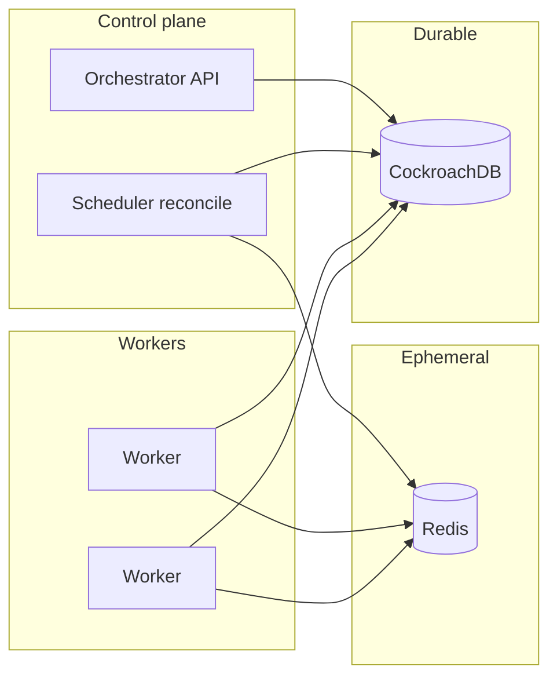

# Distributed task orchestrator — technical specification

This document is the authoritative design for a **distributed task orchestrator** implemented in **Go**, with **CockroachDB** as the durable source of truth and **Redis** for queues, leases, and coordination.

---

## 1. Purpose and non-goals

### Purpose

The system shall:

- Accept **jobs** composed of one or more **tasks**, each bound to a handler **`kind`** (string key) and **payload** (JSON).
- Persist definitions, state, and history in **CockroachDB**.
- Move runnable work through **Redis** (ready queues, visibility leases, optional delayed scheduling hints).
- Run **workers** that poll Redis, execute registered handlers, and report outcomes back to CockroachDB.
- Support **retries** with configurable max attempts and backoff (policy stored on the task row; orchestrator applies transitions).
- Support optional **DAG dependencies** between tasks within a job: a task becomes eligible only when all dependencies have completed successfully.

### Non-goals (v1)

- Visual workflow designer or end-user UI.
- Cross-region active-active orchestration (single logical region / deployment is assumed unless stated later).
- Strong exactly-once execution guarantees (the contract is **at-least-once**; handlers must be idempotent where required).
- Arbitrary dynamic graphs across jobs (dependencies are **within** a `job_id` only).

---

## 2. High-level architecture

**CockroachDB** holds canonical job/task state, dependency edges, run history, and idempotency keys. **Redis** holds ephemeral queue entries and lease metadata so many workers can claim work quickly without hammering CRDB on every poll.

**Control plane:** an **orchestrator** process exposes an API (HTTP and/or gRPC) and runs scheduler loops: create jobs/tasks in CRDB, resolve dependencies, enqueue task IDs into Redis when tasks become runnable, and **reconcile** Redis from CRDB if Redis data is lost or stale.

**Data plane:** **worker** processes register handlers by `kind`, poll Redis for available work, extend leases while running, and on completion update CRDB (success/failure/retry scheduling). The orchestrator may then enqueue the next runnable tasks (including dependents).



**Invariant:** If Redis is flushed or inconsistent, the system must remain correct by scanning CRDB for tasks that are `pending` or `running` (with expired leases) and re-enqueueing. Redis is an optimization, not the system of record.

---

## 3. Repository folder structure

Idiomatic Go layout with multiple binaries and a small public package for task authors.

```
distributed_task_queue/
├── cmd/
│   ├── orchestrator/          # API + scheduler / reconciler entrypoint
│   └── worker/                # Worker process entrypoint
├── internal/
│   ├── config/                # Env and config loading
│   ├── db/                    # CRDB pool, queries, transaction helpers
│   ├── redis/                 # Redis client, key helpers, queue + lease ops
│   ├── orchestrator/          # Domain: jobs, tasks, deps, state machine
│   └── worker/                # Runtime: poll, lease, invoke handlers, ack/nack
├── pkg/
│   └── worker/                # Stable types + Runtime/Handler API for imports
├── migrations/                # SQL migrations (e.g. goose, golang-migrate)
├── INSTRUCTIONS.md            # This document
└── README.md
```

- **`cmd/orchestrator`:** wires config, DB, Redis, HTTP/gRPC servers, and background reconciler.
- **`cmd/worker`:** constructs `pkg/worker.Runtime`, registers kinds, runs until signal shutdown.
- **`internal/*`:** implementation details not imported by external modules.
- **`pkg/worker`:** minimal surface for teams that define tasks in separate repos: `Task`, `Handler`, `Runtime`, and option types.

---

## 4. CockroachDB schema

### Conventions

- Primary keys: **UUID** (v4 or v7 — v7 can improve insert locality; either is acceptable if documented).
- Timestamps: **`TIMESTAMPTZ`** everywhere.
- Status fields: use **`STRING`** with enumerated values documented below (or `ENUM`-like check constraints if preferred).
- **Transaction boundaries:** creating a job with all tasks and dependency rows MUST occur in **one transaction**. Transitioning a task and inserting a `task_runs` row for a new attempt SHOULD be one transaction where practical.

### Enumerated values

**`jobs.status`:** `pending`, `running`, `completed`, `failed`, `cancelled`

**`tasks.status`:** `pending`, `queued`, `running`, `completed`, `failed`, `cancelled`

**`task_runs.status`:** `running`, `succeeded`, `failed`, `dead`

### DDL

```sql
CREATE TABLE jobs (
    id UUID NOT NULL PRIMARY KEY DEFAULT gen_random_uuid(),
    name STRING NOT NULL,
    status STRING NOT NULL,
    metadata JSONB,
    idempotency_key STRING UNIQUE,
    created_at TIMESTAMPTZ NOT NULL DEFAULT now(),
    updated_at TIMESTAMPTZ NOT NULL DEFAULT now()
);

CREATE INDEX idx_jobs_status_updated ON jobs (status, updated_at DESC);

CREATE TABLE tasks (
    id UUID NOT NULL PRIMARY KEY DEFAULT gen_random_uuid(),
    job_id UUID NOT NULL REFERENCES jobs (id) ON DELETE CASCADE,
    name STRING NOT NULL DEFAULT '',
    kind STRING NOT NULL,
    status STRING NOT NULL,
    payload JSONB,
    max_attempts INT NOT NULL DEFAULT 3,
    attempt INT NOT NULL DEFAULT 0,
    scheduled_at TIMESTAMPTZ NOT NULL DEFAULT now(),
    started_at TIMESTAMPTZ,
    finished_at TIMESTAMPTZ,
    last_error STRING,
    created_at TIMESTAMPTZ NOT NULL DEFAULT now(),
    updated_at TIMESTAMPTZ NOT NULL DEFAULT now()
);

CREATE INDEX idx_tasks_job_id ON tasks (job_id);
CREATE INDEX idx_tasks_status_scheduled ON tasks (status, scheduled_at);
CREATE INDEX idx_tasks_kind_status ON tasks (kind, status);

CREATE TABLE task_dependencies (
    task_id UUID NOT NULL REFERENCES tasks (id) ON DELETE CASCADE,
    depends_on_task_id UUID NOT NULL REFERENCES tasks (id) ON DELETE CASCADE,
    PRIMARY KEY (task_id, depends_on_task_id),
    CONSTRAINT no_self_dependency CHECK (task_id <> depends_on_task_id)
);

CREATE INDEX idx_task_dependencies_depends ON task_dependencies (depends_on_task_id);

CREATE TABLE task_runs (
    id UUID NOT NULL PRIMARY KEY DEFAULT gen_random_uuid(),
    task_id UUID NOT NULL REFERENCES tasks (id) ON DELETE CASCADE,
    attempt_number INT NOT NULL,
    worker_id STRING NOT NULL,
    status STRING NOT NULL,
    error STRING,
    started_at TIMESTAMPTZ NOT NULL DEFAULT now(),
    finished_at TIMESTAMPTZ
);

CREATE INDEX idx_task_runs_task_id ON task_runs (task_id, started_at DESC);

-- Optional: registry for ops / dashboards. Leases remain Redis-first to avoid hot rows.
CREATE TABLE workers (
    id STRING NOT NULL PRIMARY KEY,
    hostname STRING,
    last_heartbeat_at TIMESTAMPTZ NOT NULL DEFAULT now(),
    metadata JSONB
);
```

### Tradeoff: `workers` table vs Redis-only leases

- **Redis-only leases:** fewer CRDB writes under high churn; simpler scale for claim/heartbeat.
- **`workers` table:** better for auditing and static fleet views; heartbeats can be throttled (e.g. every N seconds) to limit write load.

v1 recommendation: implement **leases in Redis**; use **`workers` table** only if product needs a durable directory (optional heartbeat upsert from worker process).

### Job aggregate status (logic, not extra columns required)

Derive `jobs.status` from tasks or update it in the orchestrator when task transitions settle (e.g. all tasks `completed` → job `completed`; any task `failed` and no more retries → job `failed`). Document the chosen rule set in code next to the state machine.

---

## 5. Redis data model

Redis keys are **namespaced** with a configurable prefix (e.g. `dto:` for “distributed task orchestrator”).

### Ready queue

- **Streams (recommended for consumer groups):**  
  `dto:queue:ready:{priority}` — stream entries with fields at minimum `task_id` (UUID string). Priorities `low`, `default`, `high` or numeric tiers as needed.
- **Alternative — Lists:**  
  `dto:queue:ready:{priority}` as LIST with `LPUSH` / `BRPOP` — simpler but no built-in consumer-group ack model; lease handling must be stricter in application code.

### Lease / visibility

Per claimed task, store lease metadata so other workers do not claim it until expiry:

- **Hash per task:** `dto:lease:task:{task_id}`  
  Fields: `worker_id`, `deadline_ms` (or `deadline` as Unix ms string), optional `run_id` (UUID of `task_runs` row).
- **TTL:** set **EXPIRE** on the hash to slightly exceed lease duration so orphaned keys disappear; correctness still comes from CRDB reconciliation if a worker dies without releasing.

**Claim flow (conceptual):** pop or read a message from the ready structure → set lease hash → worker executes → delete hash on success path or let TTL expire on crash.

### Delayed / scheduled tasks

- **Sorted set:** `dto:queue:scheduled` — member `task_id`, score = run-after time in **Unix milliseconds**.  
  A scheduler loop uses `ZRANGEBYSCORE` up to `now` to move due tasks into the ready queue and update CRDB `tasks.status` to `queued` as needed.

### Optional: claim deduplication

- **SET with TTL:** `dto:claim:{task_id}` — short-lived token to reduce double-claim under races; must align with CRDB `tasks.status` checks so duplicates are harmless (idempotent claim).

### Rate limiting (optional v1)

- **Token bucket or sliding window** per tenant or per `kind`, e.g. Redis `INCR` with expiry or dedicated rate-limit keys `dto:ratelimit:{scope}`.

### Pub/Sub (optional)

- **Channel:** `dto:wake:scheduler` — publish when new work is enqueued so reconciler sleeps instead of tight polling.

### Canonical state

**CockroachDB always wins** for `tasks.status` and attempts. Redis entries that disagree with CRDB must be discarded during reconciliation. Recovery: query CRDB for tasks in `queued` or `running` with lease expired (or missing Redis lease) and re-enqueue.

---

## 6. Worker interface (Go)

Public API lives in **`pkg/worker`** so handlers can be developed in other modules/repos with a minimal import path.

### Types

```go
package worker

import (
    "context"
    "encoding/json"
    "time"

    "github.com/google/uuid"
)

// Task is the unit of work delivered to a Handler.
type Task struct {
    ID      uuid.UUID
    JobID   uuid.UUID
    Kind    string
    Payload json.RawMessage
    Attempt int // 1-based attempt number for this delivery
}

// Handler processes one task. Return nil on success; non-nil error triggers retry/fail policy.
type Handler func(ctx context.Context, task Task) error

// Options tune runtime behavior (zero values = defaults from config/env).
type Options struct {
    DefaultTimeout time.Duration // per-handler deadline if task does not specify
    HeartbeatEvery time.Duration // Redis lease extension interval
}

// Runtime is the worker-side execution engine.
type Runtime interface {
    Register(kind string, h Handler)
    Run(ctx context.Context) error // blocks until ctx is cancelled; returns aggregate/shutdown error
}
```

Implementations in `internal/worker` construct `Runtime` with Redis + DB clients, worker identity (`worker_id`), and registered handlers.

### Semantics

| Topic | Behavior |
|--------|----------|
| **Delivery** | **At-least-once.** The same logical attempt may be redelivered after crash, lease expiry, or network partition. |
| **Success** | Handler returns `nil` → runtime **acks**: clear lease in Redis, update CRDB task to `completed`, close `task_runs` as `succeeded`, orchestrator may enqueue dependents. |
| **Failure** | Handler returns error → runtime records error, increments attempt if under `max_attempts`, applies **backoff** to `scheduled_at`, sets status to `pending` or `queued` per policy, may re-enqueue to Redis after delay. |
| **Lease / heartbeat** | While `Handler` runs, periodically extend Redis lease (and optionally refresh `task_runs.started_at` semantics); if extension fails, cancel handler `ctx` so shutdown is cooperative. |
| **Timeouts** | If `Options.DefaultTimeout` (or per-task metadata, if later added) elapses, cancel `ctx` passed to `Handler`; treat as failure for retry purposes. |
| **Graceful shutdown** | On `ctx` cancellation: stop accepting new work; either wait for in-flight handler with a bounded grace period or stop heartbeats and let lease expire so another worker can claim (document chosen policy in implementation). |
| **Unknown kind** | If `kind` is not registered: fail the task with a permanent error (do not infinite-retry); surface clearly in logs/metrics. |

### Registration

- **`Register`** MUST panic or return error at startup if `kind` is duplicated (implementation choice; document in code).
- **`kind`** is a stable API contract: `email.send`, `report.generate`, etc. Version by suffix or new kind (`email.send.v2`) rather than breaking payloads silently.

---

## 7. Operational contracts

### Handler `kind` versioning

Treat `kind` as an immutable contract. Payload evolution: add optional JSON fields; for breaking changes, introduce a new `kind` and migrate producers.

### Payload schema

No enforced schema in v1 beyond JSON; document expected fields per `kind` in team runbooks or optional JSON Schema files colocated with handlers.

### Metrics and logging

- **Orchestrator:** request metrics, job creation latency, reconcile loop lag, CRDB/Redis error rates.
- **Worker:** tasks claimed, succeeded, failed, retries, handler duration, lease extensions, shutdown reason.
- Hook interfaces MAY be added later under `internal/observability` without changing the minimal `pkg/worker` surface.

### Migrations

- Store SQL under **`migrations/`** with sequential versions.
- Run migrations from **`cmd/orchestrator`** on deploy or as a one-shot job; document in README.

### Configuration (reference)

Environment variables (names are illustrative): `CRDB_DSN`, `REDIS_ADDR`, `REDIS_KEY_PREFIX`, `ORCHESTRATOR_LISTEN`, `WORKER_CONCURRENCY`, `LEASE_DURATION`, `RECONCILE_INTERVAL`.

---

## 8. Summary

| Layer | Responsibility |
|--------|----------------|
| **CockroachDB** | Jobs, tasks, DAG edges, run history, idempotency, authoritative status |
| **Redis** | Ready queue, leases, scheduled ZSET, optional wake/ratelimit |
| **Orchestrator** | API, enqueue, dependency resolution, reconciliation |
| **Worker (`pkg/worker`)** | Register `Handler` by `kind`, `Run` loop, at-least-once execution with lease + heartbeat |

This spec is sufficient to scaffold `go.mod`, migrations, and the first vertical slice: create job → enqueue → worker runs handler → persist result.
